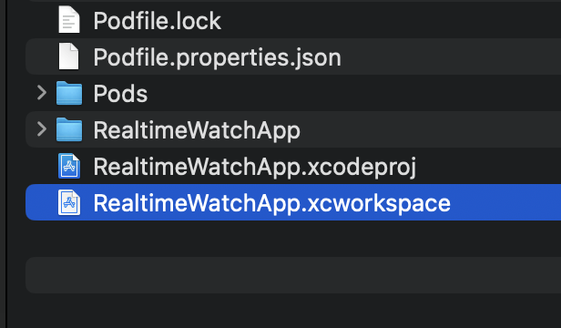
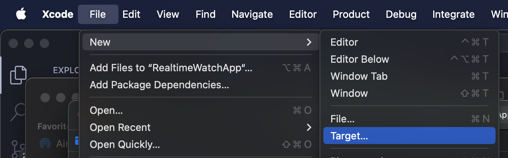
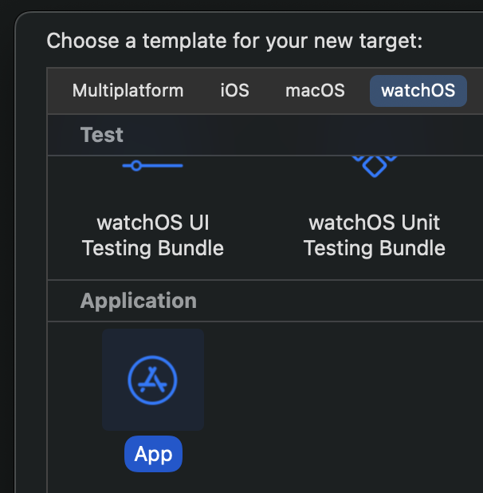
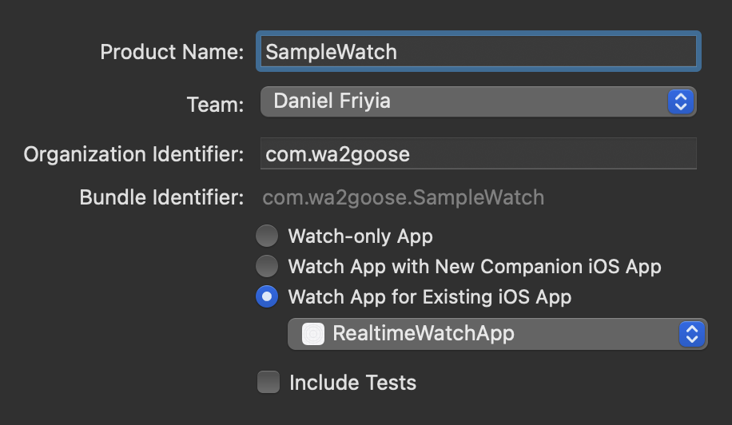
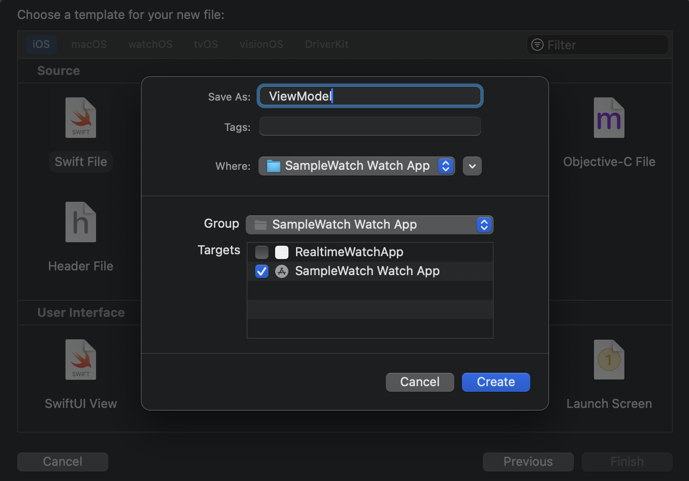
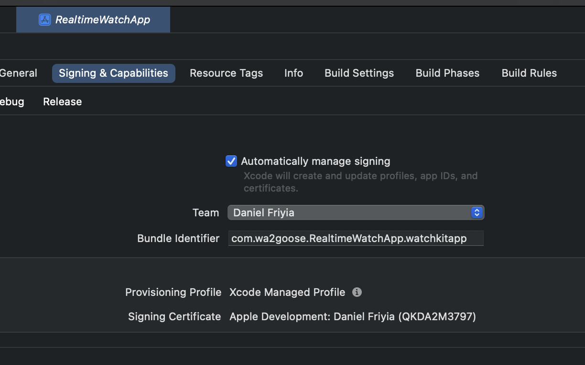
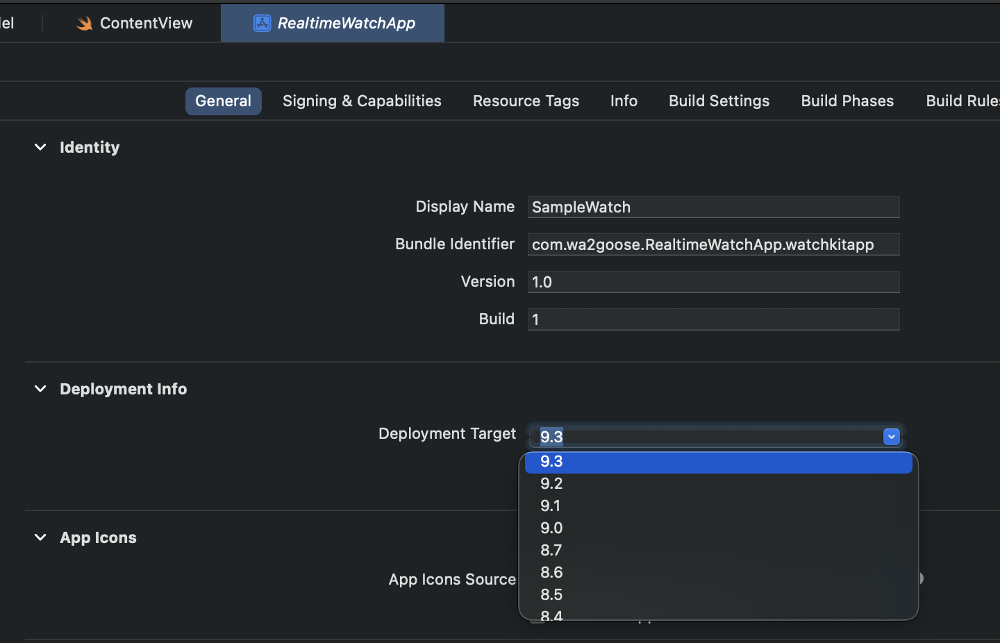
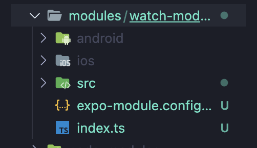
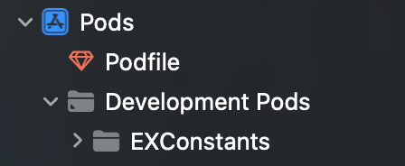
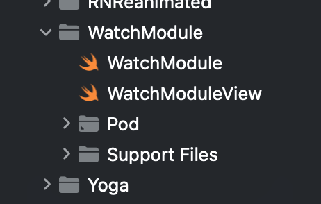

# How to make a Realtime Accelerometer app using Expo and Apple Watch

> [!NOTE]
> If you don't care about the steps and just want to try this out then do the following
>
> 1. Clone the project
> 2. `cd` into the project and run `yarn`
> 3. Run `npx expo prebuild --clean`
> 4. Run `npx expo run:ios`

## Video Notes

## Phase 1: Run Expo Prebuild

In order to start the project you're going to need an ios project. To generate this run:

```bash
$ npx expo prebuild
```

## Phase 2: Add a Watch Target to your Project

Open your React Native project and find the `xcworkspace` in your `ios` folder.

<p align="center">

</p>

Create a new target by going to `File > Target`

<p align="center">

</p>

In the target screen go into `watchOS` and select app

<p align="center">

</p>

On the options screen choose Watch App for Existing iOS app and choose `RealTimeWatchApp`. Name the project `SampleWatch` and press finish and press activate.

<p align="center">

</p>

## Phase 3: Create your Apple Watch App

Create a new swift file called `ViewModel.swift`. This is going to contain all of our accelerometer logic.

<p align="center">

</p>

<p align="center">

</p>

Add the following code to the ViewModel. This isn't a Swift lesson so I am not going to get into too much detail. The code comments should explain what each chunk is doing

```swift
import Foundation
import WatchConnectivity
import CoreMotion

class ViewModel: NSObject, WCSessionDelegate {
  let manager = CMMotionManager()

  override init() {
    super.init()
    // Make this class the delegate for accelerometer updates
    WCSession.default.delegate = self

    // Start the watch session so you can communicate with the iPhone
    WCSession.default.activate()
  }

  func sendMessage() {
    if manager.isAccelerometerAvailable {
       // Change the speed of the updates
       manager.accelerometerUpdateInterval = 0.1

      // Every time a new update comes in send a message to the iPhone app
      manager.startAccelerometerUpdates(to: .main, withHandler:  { data, other  in
        let x = data?.acceleration.x ?? 0
        let y = data?.acceleration.y ?? 0
        let z = data?.acceleration.z ?? 0

        WCSession.default.sendMessage(
          ["x": "\(x)", "y": "\(y)", "z": "\(z)"],
          replyHandler: { _ in
            print("HELLo")
          })
      })
    }
  }

  func session(_ session: WCSession, activationDidCompleteWith activationState: WCSessionActivationState, error: Error?) {}
}
```

Next go into the `ContentView.swift` file. In this file add the ViewModel to the top of the struct and a button that sends a message on press.

```swift
struct ContentView: View {
    let viewModel = ViewModel()
    var body: some View {
        VStack {
            Text("Hello, world!")
          Button("SEND", action: {
            viewModel.sendMessage()
          })
        }
        .padding()
    }
}
```

Lastly we'll need to do some configuration. Go to your project and find `Signing & Capabilities` in the top tab. Select your Apple Developer team and replace the None value. You'll have to repeat this for the watch target and the phone target

<p align="center">

</p>

Lastly change the Deployment Info to the version of apple watch that you have

<p align="center">

</p>

At this point you'll want to run the watch app and make sure it compiles. Try it out now and make sure everything works so far.

## Phase 4: Connect to the iPhone

In order to recieve data from the apple watch we need to use native swift code. For this we create a local native code module using:

```bash
$ npx create-expo-module watch-module --local
```

At this point you should have a `modules` directory at the root of your project containing a folder called `watch-module`

<p align="center">

</p>

Its tempting to try and edit this in VSCode, but alas, it doesn't do the greatest job of intellisesnse. Our best bet is go to into expo and open the development pods. We can do our editing from there.

<p align="center">

</p>

<p align="center">

</p>

For our purposes you can completely ignore the `WatchModuleView` we are going to be creating all our UI on the React Native side. We do, however, need to edit the `WatchModule.swift` file.

Under the `WatchModule` directory create a new swift file called `Receiver`. We are going to be using this file to "Recieve" data from the watch.

You can paste this code into the Receiver:

```swift
import Foundation
import WatchConnectivity

typealias SendEventType = (_ eventName: String, _ body: [String: Any?]) -> Void

class Receiver: NSObject, WCSessionDelegate {

  var sendEventCallback: SendEventType? = nil
  var isListening = true;

  override init() {
    super.init()
    // Set this class as the watch delegate
    WCSession.default.delegate = self
    // Start the session with the Watch
    WCSession.default.activate()
  }

  /// Register a callback to send data to RN
  func registerSendEventCallback(sendEventCallback: @escaping SendEventType) {
    isListening = true
    self.sendEventCallback = sendEventCallback
  }

  func session(_ session: WCSession, didReceiveMessage message: [String : Any]) {
    print(message)
  }

  /// Send an event to RN when new data comes in
  func session(_ session: WCSession, didReceiveMessage message: [String : Any], replyHandler: @escaping ([String : Any]) -> Void) {
    if(isListening) {
      self.sendEventCallback?("onChange", message)
    }
  }

  // Disable listening for accelerometer data
  func disableListening() {
    isListening = false;
  }

  // Junk drawer of methods required for the app to compile
  func session(_ session: WCSession, activationDidCompleteWith activationState: WCSessionActivationState, error: Error?) {}
  func sessionDidBecomeInactive(_ session: WCSession) {}
  func sessionDidDeactivate(_ session: WCSession) {}
}

```

Now back in the `WatchModule.swift` edit the file to consume that data

```swift
import ExpoModulesCore

public class WatchModule: Module {
  let receiver = Receiver()
  public func definition() -> ModuleDefinition {
    Name("WatchModule")

    Events("onChange")

    Function("startListening") {
      receiver.registerSendEventCallback(sendEventCallback: self.sendEvent)
    }

    Function("disableListening") {
      receiver.disableListening()
    }
  }
}
```

Finally change the `index.ts` in the `watch-module` to contain the following code which exposes the Swift to React Native.

```ts
import {
  NativeModulesProxy,
  EventEmitter,
  Subscription,
} from "expo-modules-core";

import WatchModule from "./src/WatchModule";

import {
  ChangeEventPayload,
  WatchModuleViewProps,
} from "./src/WatchModule.types";

export function startListening() {
  WatchModule.startListening();
}

export function disableListening() {
  WatchModule.disableListening();
}

const emitter = new EventEmitter(WatchModule ?? NativeModulesProxy.WatchModule);

export function addChangeListener(
  listener: (event: ChangeEventPayload) => void
): Subscription {
  return emitter.addListener<ChangeEventPayload>("onChange", listener);
}

export function removeListener() {
  emitter.removeAllListeners("onChange");
}

export { WatchModuleViewProps, ChangeEventPayload };
```

Also update the types file with this:

```ts
export type ChangeEventPayload = {
  x: number;
  y: number;
};
```

At this point you'll want to import the dependancies into `App.tsx`

```ts
import {
  addChangeListener,
  startListening,
  removeListener,
  disableListening,
} from "./modules/watch-module";
```

Then add this code to listen for events

```ts
const appState = useRef(AppState.currentState);
useEffect(() => {
  startListening();

  addChangeListener((val) => {
    xPosition.value = val.x;
    yPosition.value = val.y;
    zPosition.value = val.z;
  });

  return () => {
    removeListener();
  };
}, []);
```

Also add this code to check for changes in background and foreground state

```ts
useEffect(() => {
  const subscription = AppState.addEventListener("change", (nextAppState) => {
    if (nextAppState === "inactive") {
      disableListening();
      removeListener();
    }

    if (
      appState.current.match(/inactive|background/) &&
      nextAppState === "active"
    ) {
      startListening();

      addChangeListener((val) => {
        xPosition.value = val.x;
        yPosition.value = val.y;
        zPosition.value = val.z;
      });
    }

    appState.current = nextAppState;
  });

  return () => {
    subscription.remove();
  };
}, []);
```

> [!WARNING]
> DO NOT SKIP PHASE 6!!! The code will run at this point but if you run prebuild the watchOS project will be destroyed!

At this point if you run the app everything should work.

## Phase 5: Re-Create the Expo Project using a Config Plugin

At this point we'll need to move the Apple Watch code into the root folder. We do this so that it doesn't get deleted when we do a clean prebuild.

Make sure Preview Assets and Preview Content both get added.

- Run `yarn add expo-module-scripts`
- change the `"Preview Assets.xcassets"` to `"Preview Content"`
- change the `PRODUCT_BUNDLE_IDENTIFIER: "com.wa2goose.RealtimeWatchApp.watchkitapp",`
- You can now delete the `ios` and `android` folders.
- Go into the plugin directory and run `npx tsc` to compile the plugin. Then `npx expo prebuild` to run it
- Add this line to the `app.json`

```json
"plugins": ["./plugin/build/index.js"]
```
